# WebCreate · Professional Web-based Hand-drawn Creation & Animation Export Tool

> Draw in the browser, apply templates, let AI draft for you, export to PNG / GIF / WebM / MP4 in one click.
> Bundled CLI renders JSON keyframes to image or video in batch.

<p align="center">
  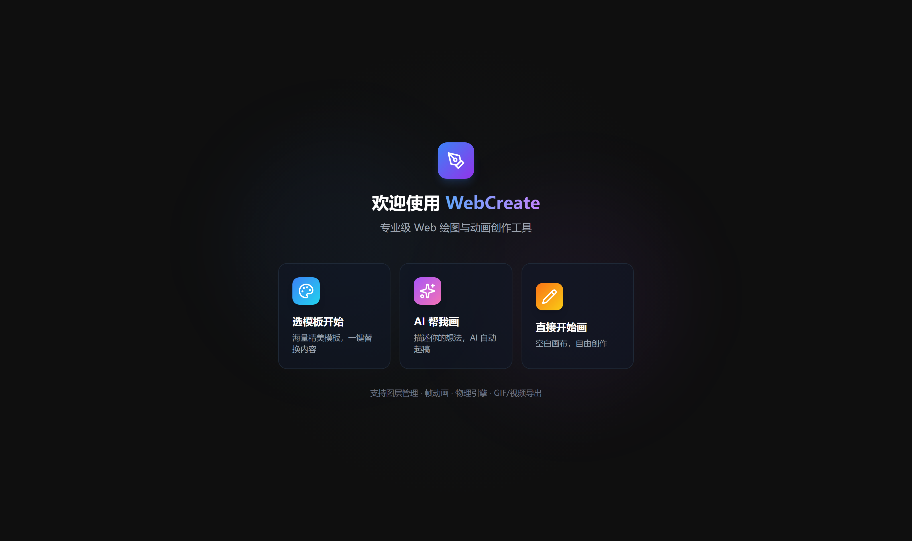
</p>

<p align="center">
  <a href="LICENSE"></a>
  <a href="https://nodejs.org/"></a>
  <a href="https://react.dev/"></a>
  <a href="https://vitejs.dev/"></a>
  <a href="https://www.typescriptlang.org/"></a>
  
  
</p>

> ⭐ If this project helps you, please give it a **Star** — GitHub search ranking heavily depends on stars and engagement, helping more people find it when searching "Excalidraw alternative / hand-drawn whiteboard / AI drawing tool".

## Table of Contents

- [One-liner](#one-liner)
- [Demo Screenshots & Videos](#demo-screenshots--videos)
- [Core Features](#core-features)
- [vs Excalidraw / tldraw](#vs-excalidraw--tldraw)
- [Tool Set (13 Tools)](#tool-set-13-tools)
- [AI Drawing](#ai-drawing)
- [Templates & Animation Templates](#templates--animation-templates)
- [Quick Start](#quick-start)
- [CLI Tool](#cli-tool)
- [CLI Real Export Demo](#cli-real-export-demo)
- [Architecture](#architecture)
- [FAQ](#faq)
- [Keywords (SEO / GEO)](#keywords-seo--geo)
- [License](#license)

---

## One-liner

**WebCreate** is a ready-to-use **web-based hand-drawn creation tool** combining **canvas editor + template library + AI drafting + physics animation + multi-format export** in one place:

- React 19 + Vite 6 + roughjs — **hand-drawn style strokes + pressure-sensitive free drawing**
- **133 static templates + 22 animation templates** covering social cards, greetings, comics, charts, etc.
- Built-in **OpenAI-compatible / Ollama / Custom / Built-in demo** AI providers — describe in one sentence to draft
- **Playwright CLI** renders JSON keyframes to **PNG / GIF / WebM / MP4** for automated pipelines

**Use cases**: social media graphics, product sketches, teaching illustrations, comic storyboards, short animations, batch video factories, AI illustration pipelines.

---

## Demo Screenshots & Videos

### Workspace · 3-column layout (Layers / Canvas / Toolbar)

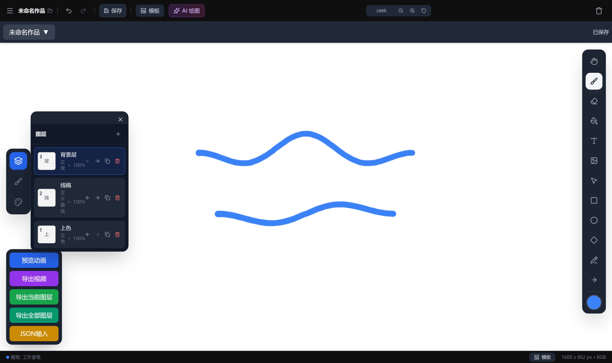

### Template Library · 133 curated templates

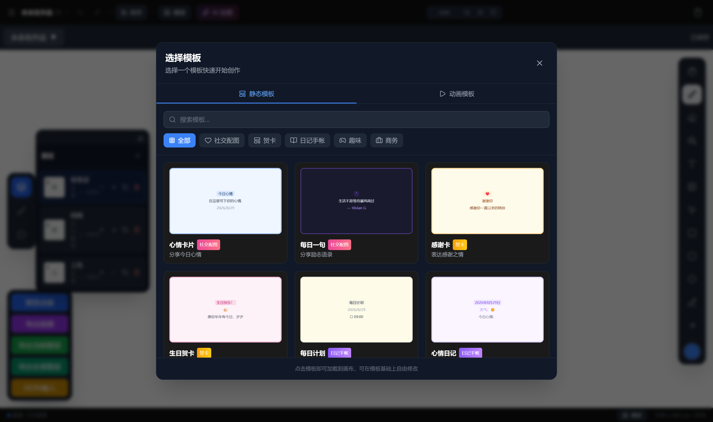

### AI Smart Drawing · natural-language draft

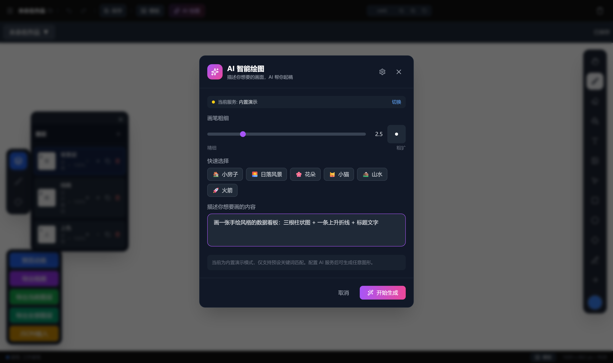

### AI Service Settings · multi-provider

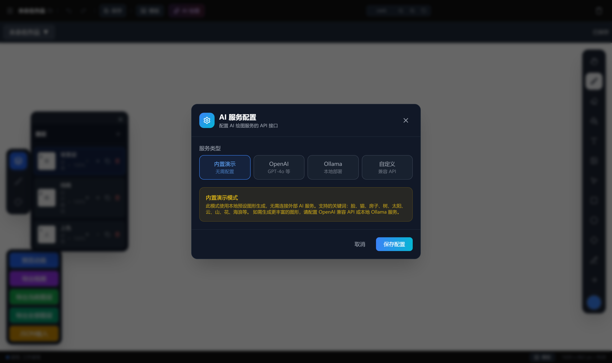

### Layers + Brushes + Color Panels

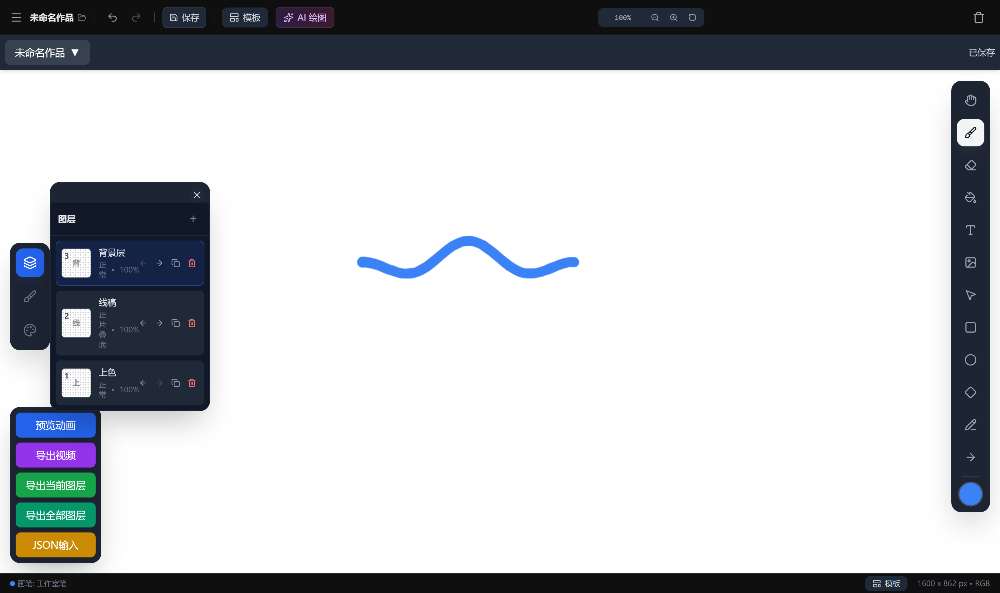

### Video: from blank canvas to hand-drawn strokes

[▶ View recording on GitHub (docs/assets/09-demo-draw.webm)](docs/assets/09-demo-draw.webm)

> Browser cannot play webm directly? Download and open with VLC / PotPlayer.

---

## Core Features

| Module | Key Capabilities |
|---|---|
| **Canvas** | Infinite canvas, zoom / pan / undo-redo, layer management, snap & align |
| **Hand-drawn Rendering** | roughjs engine + `fillStyle: hachure / cross-hatch / solid / none`, tunable `roughness` |
| **Free Drawing** | perfect-freehand with pressure-sensitivity, `points: [[x, y, pressure], ...]` tuples |
| **GIF Export** | Client-side gif.js encoding, multi-layer sequence playback, no server needed |
| **Physics Animation** | 33 easing types (spring / gravity / easeOutBack / easeOutBounce ...), stagger & keyframe interpolation |
| **AI Drafting** | Generate from one sentence (OpenAI-compatible + Ollama + Custom + Demo), brush size & theme refinement |
| **Template Apply** | 133 static + 22 animation templates, category filter + live search + one-click apply |
| **CLI Batch Export** | Render JSON keyframes to image / video / GIF, ideal for CI / automation |
| **Project Management** | localStorage persistence, unsaved / saved status, undo history |

---

## vs Excalidraw / tldraw

> WebCreate is not just another whiteboard — it packs **hand-drawn rendering + AI drafting + physics animation + CLI batch export** into one browser tool. Comparison on the dimensions searchers care about most:

| Dimension | Excalidraw | tldraw | **WebCreate** |
|-----------|-----------|--------|---------------|
| Hand-drawn engine | roughjs (built-in) | custom / switchable | **roughjs, deeply tunable** (`roughness` / `fillStyle: hachure·cross-hatch`) |
| AI Drawing | plugin / 3rd-party | self-build | **4 built-in providers** (OpenAI-compatible / Ollama / Custom / Demo) |
| Template Library | community market | partial | **133 static + 22 animation templates** |
| Physics Animation | ❌ | ❌ | **33 easing types + spring / gravity engine** |
| CLI Batch Export | ❌ | ❌ | **Playwright CLI → PNG / GIF / WebM / MP4** |
| Chinese-friendly | fair | fair | **native Chinese UI + docs + search** |
| Tech Stack | React | React | **React 19 + Vite 6 + TypeScript 5.8** |

**One-liner**: for a **Chinese-friendly, ready-to-use Excalidraw / tldraw alternative with AI drafting and CLI batch export**, choose WebCreate.

---

## Tool Set (13 Tools)

Source: `components/Toolbar/Toolbar.tsx`, `types.ts` → `ToolType`.

| ID | Name | Purpose |
|---|---|---|
| `hand` | Move canvas | Pan the canvas |
| `brush` | Brush | Free drawing (pressure-sensitive) |
| `eraser` | Eraser | Element erasing |
| `fill` | Fill | Area color fill |
| `text` | Text | Text element (Virgil and other hand-drawn fonts) |
| `image` | Image | Upload / reference image element |
| `selection` | Selection | Select / transform / rotate |
| `rectangle` | Rectangle | roughjs hand-drawn rectangle |
| `ellipse` | Ellipse | roughjs hand-drawn ellipse |
| `diamond` | Diamond | roughjs hand-drawn diamond |
| `line` | Line | Hand-drawn line segment |
| `arrow` | Arrow | Connecting line with arrowhead |
| — | Color / Brush / Layers panels | Left-side auxiliary panels |

---

## AI Drawing

- **Multi-Provider switching**: Built-in demo, OpenAI-compatible, Ollama (local), Custom API endpoint
- **Presets**: `GPT-4o`, `DeepSeek`, `SiliconFlow`, `Zhipu GLM-4-Flash`, `Ollama qwen2.5:7b`, etc.
- **API Key storage**: `localStorage[webcreate_ai_config]` — **never written to any file / repository, visible only in your local browser**
- **Request params**: `temperature` / `maxTokens` / `customHeaders` tunable
- **Theme refinement**: 6 built-in themes (house, sunset, flower, cat, landscape, rocket), brush size 1-5

> Security note: **All API Keys live in localStorage, are never committed to the repo, and are never logged by any third party.**

---

## Templates & Animation Templates

- **Static templates (133)**: social cards, greetings, comics, mood cards, diary, motivational cards, wish cards, holiday cards …
- **Animation templates (22)**: physics-engine-driven keyframe animations, smooth and natural
- **Category filter**: All / Social / Greeting / Diary / Fun / Business
- **Search**: fuzzy match on title + tags

---

## Quick Start

> Prereqs: **Node.js ≥ 22**, **pnpm ≥ 9**, **Git**.
> Users in mainland China: configure pnpm + playwright mirrors first (see below).

```bash
# 1. Clone
git clone https://github.com/Person-HE/webcreate.git
cd webcreate

# 2. Install dependencies (pnpm preferred)
npm install -g pnpm
pnpm install

# 3. Install Playwright browser (CLI export depends on it)
pnpm exec playwright install chromium
```

### Start dev server

```bash
pnpm dev
# → http://localhost:3000
```

Open [http://localhost:3000](http://localhost:3000) in your browser.

### Production build

```bash
pnpm build       # static assets → dist/
pnpm preview     # local preview of production build
```

### Mainland China mirror acceleration

```bash
# pnpm mirror
pnpm config set registry https://registry.npmmirror.com

# Playwright browser mirror
# Windows PowerShell
$env:PLAYWRIGHT_DOWNLOAD_HOST = "https://npmmirror.com/mirrors/playwright"
pnpm exec playwright install chromium

# macOS / Linux
PLAYWRIGHT_DOWNLOAD_HOST=https://npmmirror.com/mirrors/playwright pnpm exec playwright install chromium
```

---

## CLI Tool

WebCreate ships a **`webcreate`** command-line tool that uses **Playwright** to render JSON keyframes to image / video / GIF. Full AI integration guide: [`cli/AI-GUIDE.md`](cli/AI-GUIDE.md).

### Usage

```bash
# From project root
pnpm cli         # equivalent to build:cli + node cli/bin.js

# Or invoke directly
node cli/bin.js image <input.json> -o out.png  [-w 1920 -h 1080 -b "#ffffff"]
node cli/bin.js video <input.json> -o out.webm --fps 24 -d 3
node cli/bin.js gif   <input.json> -o out.gif  [-d seconds]
```

### Commands

| Command | Purpose | Key Options |
|---|---|---|
| `image` | Export the first visible layer to image | `-f png\|jpeg\|webp` (default png) |
| `video` | Export multi-layer JSON to video | `--fps 24` `-d 2` (seconds) |
| `gif` | Export multi-layer JSON to GIF | `-d 2` (seconds) |

### Input JSON Template

```jsonc
{
  "canvasWidth": 1280,
  "canvasHeight": 800,
  "backgroundColor": "#fef9ec",
  "layers": [
    {
      "id": "l1", "name": "main", "visible": true,
      "elements": [
        {
          "id": "unique-id-required",
          "type": "rectangle | ellipse | diamond | line | arrow | free_draw | text | image",
          "x": 0, "y": 0, "width": 100, "height": 100,
          "angle": 0,
          "strokeColor": "#57534e",
          "backgroundColor": "#fef3c7",
          "fillStyle": "hachure | cross-hatch | solid | none",
          "strokeWidth": 3,
          "strokeStyle": "solid | dashed | dotted",
          "roughness": 1.4, "seed": 42,
          "opacity": 100, "cornerRadius": 12,
          "strokeSharpness": "round", "layerId": "l1",
          "text": "Text content (for type=text)",
          "fontSize": 32, "fontFamily": "Virgil",
          "textAlign": "left | center | right",
          "points": [[x, y, pressure], ...]   // free_draw absolute coords
        }
      ]
    }
  ],
  "animationConfig": {
    "fps": 24, "duration": 2,
    "easingConfig": {
      "position": "easeInOutCubic | spring | gravity | easeOutBounce | ... 33 types",
      "scale": "easeOutBack",
      "rotation": "easeInOutCubic",
      "opacity": "easeInOutSine",
      "springConfig": { "mass": 1, "stiffness": 170, "damping": 12 },
      "gravityConfig": { "gravity": 9.8, "bounceRestitution": 0.5 },
      "stagger": { "enabled": true, "delayPerElement": 0.08, "maxDelay": 0.4 }
    }
  }
}
```

### Style Cheatsheet

| Style | Key Params |
|---|---|
| Hand-drawn illustration | `roughness 1.2-2.2` + `hachure / cross-hatch` fill + `Virgil` font |
| Comic | thick black border + geometric characters + oval speech bubbles + Virgil text |
| Chart | rectangles + `line` polylines + `ellipse` rings + legend color blocks |
| Sketch | `free_draw` + `strokeWidth 8-16` (pressure from `points[2]`) |
| Transparent background | `backgroundColor: "transparent"`, output `png` / `webp` |

### Animation Cheatsheet

- **Video / GIF**: `layers` are keyframes (first = start, last = end), elements with same `id` auto-interpolate
- **Bouncing drop**: `position: "gravity"` + `gravityConfig`
- **Elastic overshoot**: `position/scale: "spring"` or `easeOutBack` / `easeOutElastic`
- **Stagger reveal**: `stagger.enabled: true` + `delayPerElement`
- **More than 2 layers**: segment-wise interpolation (frame-by-frame)
- **ffmpeg fallback**: outputs `.webm` if ffmpeg is missing (auto-fallback); install ffmpeg for `.mp4`

---

## CLI Real Export Demo

> All assets below are **real CLI outputs**, rendered from JSON keyframes via `node cli/bin.js ...`, with zero post-processing.

### Static Export (PNG · roughjs hand-drawn)

| Chart | Comic panels | Freehand |
|-------|--------------|----------|
| 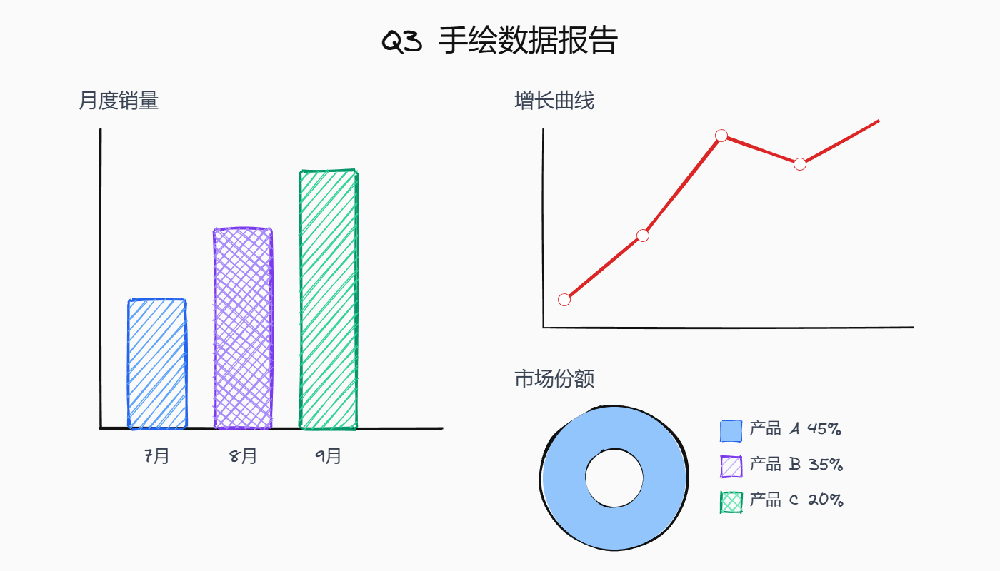 | 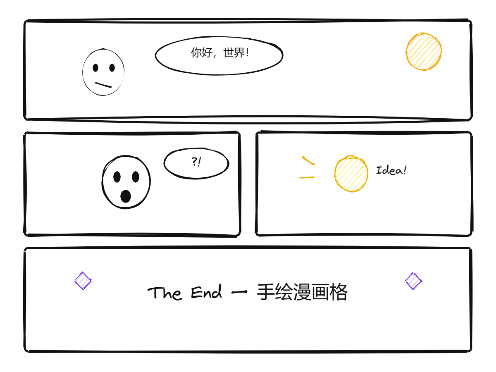 | 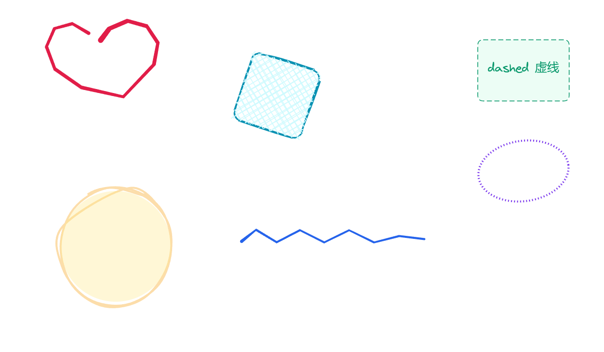 |

| House illustration | Multi-layer | Transparent background |
|--------------------|-------------|------------------------|
| 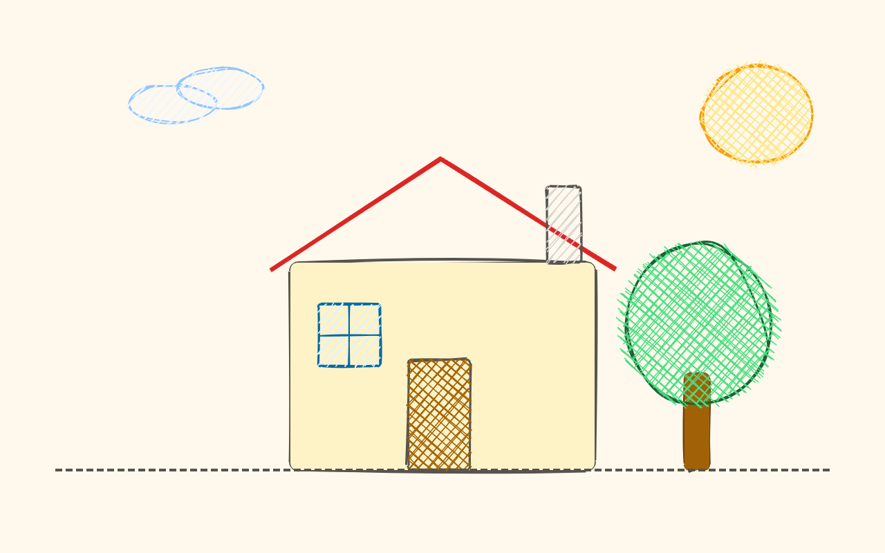 | 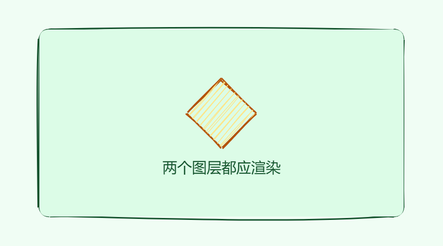 | 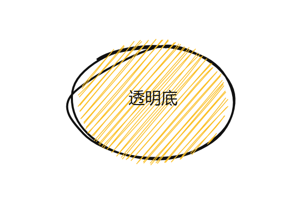 |

### Animation Export (GIF · client-side gif.js)


### HD Animation (WebM · physics engine)

- [▶ Physics bounce — gravity (physics-bounce.webm)](docs/assets/cli-demo/physics-bounce.webm)
- [▶ Spring morph — spring (morph-spring.webm)](docs/assets/cli-demo/morph-spring.webm)

> These assets are exported by the CLI from the JSON files under `outputs/test/` (e.g. `charts.json`, `comic-panels.json`, `anim1.json`), and can serve as your own input/output references.

---

## Architecture

```
webcreate/
├── App.tsx                      # Root component (routing / modal state)
├── index.tsx                    # App entry
├── store.tsx                    # Global state
├── types.ts                     # Element / Tool / Layer / Brush types
├── metadata.json                # Metadata
│
├── components/                  # 14 React components
│   ├── Layout/                  # Header / SidebarLeft / Footer
│   ├── Canvas/CanvasBoard.tsx   # Main canvas (roughjs + perfect-freehand)
│   ├── Panels/                  # Layers / Brushes / Color panels
│   ├── Toolbar/Toolbar.tsx      # 13 tools
│   ├── WelcomeScreen.tsx
│   ├── AIDrawModal.tsx
│   ├── AISettingsModal.tsx
│   ├── TemplateModal.tsx
│   ├── AnimationTemplateModal.tsx
│   └── ProjectManagerModal.tsx
│
├── services/                    # 4 service modules
│   ├── aiClient.ts              # AI HTTP client
│   ├── aiConfig.ts              # AI Provider config / presets
│   ├── aiPromptBuilder.ts       # AI prompt builder
│   └── aiService.ts             # AI business wrapper
│
├── data/                        # Built-in data
│   ├── templates.ts             # 133 static templates
│   └── animationTemplates.ts    # 22 animation templates
│
├── utils/                       # 5 utility modules
│   ├── elementTransformers.ts
│   ├── exportGif.ts
│   ├── physicsAnimation.ts      # Physics engine
│   ├── renderScene.ts
│   └── tweenAnimation.ts        # 33 easing types
│
├── cli/                         # CLI
│   ├── bin.js                   # CLI entry (shebang: #!/usr/bin/env node)
│   ├── index.ts
│   ├── export-image.ts
│   ├── export-video.ts
│   ├── export-gif.ts
│   ├── renderer.ts              # Playwright rendering engine
│   ├── render-page.ts
│   ├── types.ts / utils.ts
│   ├── public/
│   ├── AI-GUIDE.md              # AI integration guide
│   └── render.html
│
├── docs/                        # Documentation
│   └── assets/                  # README screenshots & videos
│
├── vite.config.ts
├── vite.cli.config.ts
├── tsconfig.json
├── vercel.json                  # Vercel SPA routing fallback
├── package.json
├── package-lock.json
├── .gitignore
└── README.md / README.en.md
```

**Key dependencies**:

| Library | Purpose |
|---|---|
| `react 19` + `react-dom 19` | Latest React |
| `roughjs 3` | Hand-drawn style rendering |
| `perfect-freehand 1.2` | Pressure-sensitive free drawing |
| `gif.js 0.2` | Client-side GIF encoding |
| `lucide-react` | SVG icons |
| `uuid 13` | Unique IDs |
| `playwright 1.50` | CLI browser automation |
| `vite 6` + `@vitejs/plugin-react 5` | Build tool |
| `typescript 5.8` | Type system |

---

## FAQ

<details>
<summary><b>Q1: <code>pnpm dev</code> says port 3000 is in use?</b></summary>

```bash
# Windows PowerShell
netstat -ano | findstr :3000
taskkill /PID <PID> /F

# macOS / Linux
lsof -i :3000
kill -9 <PID>
```

Or change `server.port` in `vite.config.ts`.
</details>

<details>
<summary><b>Q2: Playwright browser download fails / times out?</b></summary>

See [Mainland China mirror acceleration](#mainland-china-mirror-acceleration).

```bash
PLAYWRIGHT_SKIP_BROWSER_DOWNLOAD=1 pnpm install
pnpm exec playwright install chromium
```
</details>

<details>
<summary><b>Q3: CLI export reports <code>browser not found</code>?</b></summary>

Install Chromium:

```bash
pnpm exec playwright install chromium
```
</details>

<details>
<summary><b>Q4: AI drawing unresponsive / returns 401?</b></summary>

Open workspace → top bar **AI 绘图** → gear icon → switch to **OpenAI / Ollama / Custom** → enter correct `apiUrl` and `apiKey` → save.

API Keys are stored in `localStorage`, **never written to any file**.
</details>

<details>
<summary><b>Q5: Video export has no audio / no MP4?</b></summary>

CLI auto-falls back to `.webm` if ffmpeg is missing. All modern browsers support webm.
</details>

<details>
<summary><b>Q6: pnpm reports <code>ERR_PNPM_PEER_DEP_ISSUE</code>?</b></summary>

Create `.npmrc` in project root:

```ini
strict-peer-dependencies=false
```

Then `pnpm install`.
</details>

<details>
<summary><b>Q7: Can I deploy to Vercel / Netlify?</b></summary>

Yes. Run `pnpm build` → upload `dist/`. `vercel.json` is included for SPA routing fallback. **Note**: the CLI tool needs local Chromium and cannot be invoked in pure static hosting; run it on any Node.js machine.
</details>

<details>
<summary><b>Q8: Can template assets be used commercially?</b></summary>

WebCreate template visuals (rectangles, ellipses, lines, text) are procedurally generated by roughjs, **containing no third-party copyrighted material**. Free for commercial use.
</details>

---

## Keywords (SEO / GEO)

> This section is designed to maximize matching by search engines, AI search (Bing / Perplexity / SearchGPT / 文心 / Kimi), and GEO generative engines.

### Topics

`webcreate`, `excalidraw alternative`, `tldraw alternative`, `sketch app`, `hand drawn drawing`, `whiteboard`, `canvas editor`, `online drawing tool`, `web drawing tool`, `browser sketch`, `roughjs`, `perfect-freehand`, `vite drawing app`, `react canvas editor`

### Tech Stack

`React 19`, `Vite 6`, `TypeScript 5.8`, `roughjs`, `perfect-freehand`, `gif.js`, `Playwright`, `lucide-react`, `OpenAI compatible API`, `Ollama`, `DeepSeek`, `SiliconFlow`, `Zhipu GLM`, `localStorage persistence`, `hand-drawn SVG`, `physics animation engine`, `33 easing types`, `keyframe animation`, `keyframe interpolation`, `CLI tool`, `Node.js 22`

### Use Cases

`social media graphics generator`, `xiaohongshu image tool`, `wechat cover`, `bilibili cover`, `douyin short video asset`, `AI drafting`, `AI illustration`, `comic storyboard`, `teaching illustration`, `product sketch`, `hand-drawn data visualization`, `hand-drawn infographic`, `online whiteboard`, `whiteboard collaboration`, `short animation generator`, `batch video factory`, `video automation`, `batch image generation`, `stagger animation`, `spring physics`

### Synonyms / Look-alikes

`Excalidraw`, `tldraw`, `Figma sketch`, `Miro alternative`, `Microsoft Whiteboard`, `Whimsical`, `draw.io`, `diagrams.net`, `sketch.io`, `autodraw`, `quickdraw`

### One-liner positioning (for AI search snippet extraction)

> WebCreate is a **web-based hand-drawn canvas editor** combining **roughjs hand-drawn rendering + perfect-freehand pressure-sensitive free drawing + 133 templates + 22 physics animations + AI one-sentence drafting (OpenAI / Ollama / DeepSeek / Zhipu) + Playwright CLI export to PNG / GIF / WebM / MP4**. A **Chinese-friendly alternative to Excalidraw / tldraw** for social graphics, teaching illustrations, comic storyboards, and batch video pipelines.

---

## 🌟 If this project helped you

- Give it a **⭐ Star** so more people searching "hand-drawn whiteboard / Excalidraw alternative / AI drawing tool / batch image export" can find it
- Open an **Issue** with feature requests or bugs
- Share it on your blog / socials with the repo link

> Discoverability tip: in repo **Settings → About**, fill a keyword-rich **Description**, add **Topics** (see suggestions below), and set a **live demo Homepage URL** — this significantly boosts GitHub search and Google / Bing / Perplexity hits.

---

## License

Private. This is a personal project — do not use source code / branding / assets without permission.
